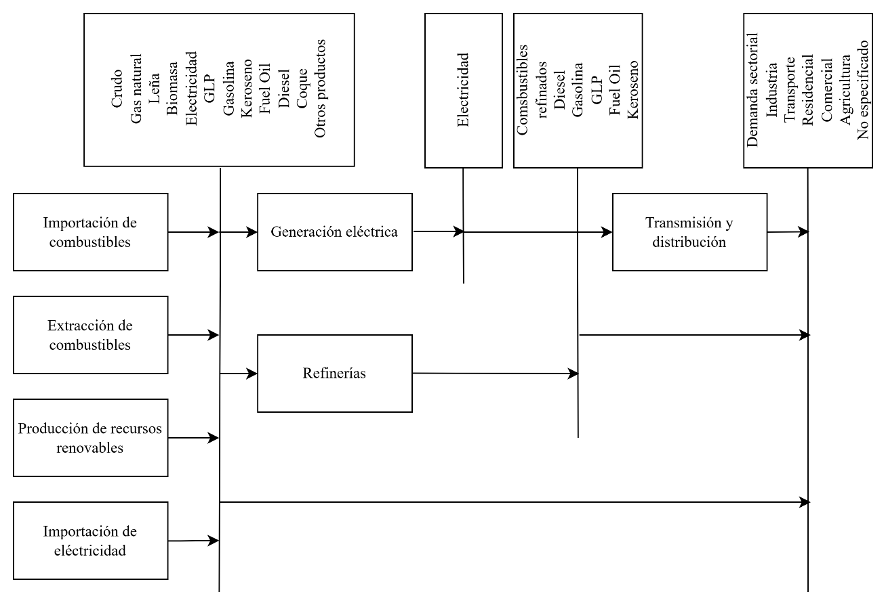

===================================
Estructura del modelo
===================================

El sector Energía en el Escenario Tendencial Nacional, se modeló
recurriendo a la herramienta OSeMOSYS (Open Source Energy Modellling
System por sus siglas en inglés).

En particular:

- Del modelo OSeMOSYS que da soporte al PLANMICC (Proyecto CZZ 2739) se
  toman las estructuras y parametrizaciones base de tecnologías, con la
  misma desagregación originalmente desarrollada. Para el sector
  Transporte se utilizan los mismos valores de oferta y demanda
  energética considerados en el modelo OSeMOSYS que da soporte al
  PLANMICC desde el 2018 hasta el 2035. Por falta de información, se
  considera también constante la demanda en el sector Transporte desde
  el 2010 hasta el 2017. Además, se consideran los costos fijos y
  variables por tipo de tecnología y factores de emisión históricos
  considerados en el modelo OSeMOSYS que da soporte al PLANMICC.

- Del modelo OSeMOSYS utilizado para estructurar la segunda NDC se
  toman: i) datos de generación de electricidad por tipo de tecnología
  máxima y mínima, ii) demandas energéticas por sectores, iii) factores
  de capacidad por tipo de tecnología y iv) capacidades residuales y
  máximas.

**Representación Gráfica del Modelo**

El modelo del sector Energía fue estructurado a partir de la base
desarrollada en modelo OSeMOSYS que da soporte al PLANMICC (Proyecto CZZ
2739). No se aumentaron tecnologías ni se adicionaron variables,
únicamente se actualizó información.
El modelo del sector Energía se desarrolló a partir de la estructura
base desarrollada en el modelo OSeMOSYS que da soporte al PLANMICC. No
se aumentaron tecnologías ni se adicionaron variables, únicamente se
actualizó información que se pude apreciar en la :numref:`table_inputs_energy`
denominada **Fuentes de información utilizadas para el proceso de modelado del
Escenario Tendencial Nacional del sector Energía**, de la
sección :ref:`energy_data_input`.

En la :numref:`model_structure_energy` se muestra la estructura final del modelo para el
sector Energía utilizado en el proceso de formulación del Plan de Acción
del PLANMICC, Fase I, utilizando la tipología RES (*Reference Energy
System*, por sus siglas en inglés).

   Estructura Base del modelo de Energía

.. note:: Puede acceder a la Estructura base del modelo completo a través del siguiente enlace:
         :download:`RES Energía <../_static/docs/RES Energía.vsdx>`

**Tecnologías**

.. _table_techs_energy:
.. table:: Tecnologías consideradas en el modelo del sector energía durante la construcción del Escenario Tendencial Nacional

   +-----------------------------------+-----------------------------------+
   | Código                            | Detalle                           |
   +===================================+===================================+
   | BLEND_DSL                         | Mezcla de diésel                  |
   +-----------------------------------+-----------------------------------+
   | BLEND_GSL                         | Mezcla de gasolina                |
   +-----------------------------------+-----------------------------------+
   | CENGASGSL                         | Centros de gas gasolina           |
   +-----------------------------------+-----------------------------------+
   | CENGASLPG                         | Centros de gas GLP                |
   +-----------------------------------+-----------------------------------+
   | CENGASPRO                         | Centros de gas propano            |
   +-----------------------------------+-----------------------------------+
   | ELE_DISTR                         | Secundario - Distribución de      |
   |                                   | energía eléctrica                 |
   +-----------------------------------+-----------------------------------+
   | ELE_TRANS                         | Secundario - Transmisión de       |
   |                                   | energía eléctrica                 |
   +-----------------------------------+-----------------------------------+
   | HYD_DISTR                         | Secundario - Distribución de      |
   |                                   | hidrógeno                         |
   +-----------------------------------+-----------------------------------+
   | HYDPROBIO                         | Secundario - Producción de        |
   |                                   | hidrógeno verde - biomasa         |
   +-----------------------------------+-----------------------------------+
   | HYDPROELEGRI                      | Secundario - Producción de        |
   |                                   | hidrógeno verde - electrólisis    |
   |                                   | con red                           |
   +-----------------------------------+-----------------------------------+
   | HYDPROELEISO                      | Secundario - Producción de        |
   |                                   | hidrógeno verde - electrólisis en |
   |                                   | sistemas aislados                 |
   +-----------------------------------+-----------------------------------+
   | HYDPRONGS                         | Secundario - Producción de        |
   |                                   | hidrógeno verde - reformado de    |
   |                                   | gas natural                       |
   +-----------------------------------+-----------------------------------+
   | IMPCOA                            | Importación/Distribución - carbón |
   +-----------------------------------+-----------------------------------+
   | IMPCOK                            | Importación - coque de petróleo   |
   +-----------------------------------+-----------------------------------+
   | IMPCRU                            | Importación - crudo               |
   +-----------------------------------+-----------------------------------+
   | IMPELE                            | Importación - electricidad        |
   +-----------------------------------+-----------------------------------+
   | IMPFOI                            | Importación/Distribución - fuel   |
   |                                   | oil                               |
   +-----------------------------------+-----------------------------------+
   | IMPKJF                            | Importación/Distribución -        |
   |                                   | queroseno y jet fuel              |
   +-----------------------------------+-----------------------------------+
   | IMPLPG                            | Importación/Distribución - GLP    |
   +-----------------------------------+-----------------------------------+
   | IMPNGS                            | Importaciones - gas natural (GNL  |
   |                                   | y regasificación)                 |
   +-----------------------------------+-----------------------------------+
   | IMPPURDSL                         | Importación/Distribución - diésel |
   |                                   | puro                              |
   +-----------------------------------+-----------------------------------+
   | IMPPURGSL                         | Importación/Distribución -        |
   |                                   | gasolina pura                     |
   +-----------------------------------+-----------------------------------+
   | NGS_DISTR                         | Distribución de gas natural       |
   +-----------------------------------+-----------------------------------+
   | PP_BGSICE                         | Central eléctrica biogás - motor  |
   |                                   | de combustión interna             |
   +-----------------------------------+-----------------------------------+
   | PP_BMSTST                         | Central eléctrica biomasa -       |
   |                                   | turbina de vapor                  |
   +-----------------------------------+-----------------------------------+
   | PP_CHP                            | Central eléctrica cogeneración    |
   |                                   | caña de azúcar                    |
   +-----------------------------------+-----------------------------------+
   | PP_COA                            | Central eléctrica carbón          |
   +-----------------------------------+-----------------------------------+
   | PP_CRU                            | Central eléctrica crudo           |
   +-----------------------------------+-----------------------------------+
   | PP_DSLICE                         | Central eléctrica diésel - motor  |
   |                                   | de combustión interna             |
   +-----------------------------------+-----------------------------------+
   | PP_DSLTGS                         | Central eléctrica diésel -        |
   |                                   | turbina de gas                    |
   +-----------------------------------+-----------------------------------+
   | PP_FOIICE                         | Central eléctrica fuel oil -      |
   |                                   | motor de combustión interna       |
   +-----------------------------------+-----------------------------------+
   | PP_FOITST                         | Central eléctrica fuel oil -      |
   |                                   | turbina de vapor                  |
   +-----------------------------------+-----------------------------------+
   | PP_GEO                            | Primario - Transformación -       |
   |                                   | geotérmica                        |
   +-----------------------------------+-----------------------------------+
   | PP_HYDAMADAMLAR                   | Primario - Transformación -       |
   |                                   | hidroeléctrica Amazonas represa   |
   |                                   | (grande)                          |
   +-----------------------------------+-----------------------------------+
   | PP_HYDAMADAMMED                   | Primario - Transformación -       |
   |                                   | hidroeléctrica Amazonas represa   |
   |                                   | (mediana)                         |
   +-----------------------------------+-----------------------------------+
   | PP_HYDAMADAMSMA                   | Primario - Transformación -       |
   |                                   | hidroeléctrica Amazonas represa   |
   |                                   | (pequeña)                         |
   +-----------------------------------+-----------------------------------+
   | PP_HYDAMARORLAR                   | Primario - Transformación -       |
   |                                   | hidroeléctrica Amazonas de pasada |
   |                                   | (grande)                          |
   +-----------------------------------+-----------------------------------+
   | PP_HYDAMARORMED                   | Primario - Transformación -       |
   |                                   | hidroeléctrica Amazonas de pasada |
   |                                   | (mediana)                         |
   +-----------------------------------+-----------------------------------+
   | PP_HYDAMARORSMA                   | Primario - Transformación -       |
   |                                   | hidroeléctrica Amazonas de pasada |
   |                                   | (pequeña)                         |
   +-----------------------------------+-----------------------------------+
   | PP_HYDPACDAMLAR                   | Primario - Transformación -       |
   |                                   | hidroeléctrica Pacific represa    |
   |                                   | (grande)                          |
   +-----------------------------------+-----------------------------------+
   | PP_HYDPACDAMMED                   | Primario - Transformación -       |
   |                                   | hidroeléctrica Pacific represa    |
   |                                   | (mediana)                         |
   +-----------------------------------+-----------------------------------+
   | PP_HYDPACDAMSMA                   | Primario - Transformación -       |
   |                                   | hidroeléctrica Pacific represa    |
   |                                   | (pequeña)                         |
   +-----------------------------------+-----------------------------------+
   | PP_HYDPACRORLAR                   | Primario - Transformación -       |
   |                                   | hidroeléctrica Pacific de pasada  |
   |                                   | (grande)                          |
   +-----------------------------------+-----------------------------------+
   | PP_HYDPACRORMED                   | Primario - Transformación -       |
   |                                   | hidroeléctrica Pacific de pasada  |
   |                                   | (mediana)                         |
   +-----------------------------------+-----------------------------------+
   | PP_HYDPACRORSMA                   | Primario - Transformación -       |
   |                                   | hidroeléctrica Pacific de pasada  |
   |                                   | (pequeña)                         |
   +-----------------------------------+-----------------------------------+
   | PP_NGSTGS                         | Central eléctrica gas natural -   |
   |                                   | turbina de gas                    |
   +-----------------------------------+-----------------------------------+
   | PP_SPV_DG                         | Primario - Transformación - solar |
   |                                   | distribuida                       |
   +-----------------------------------+-----------------------------------+
   | PP_SPV_US                         | Primario - Transformación -       |
   |                                   | fotovoltaica                      |
   +-----------------------------------+-----------------------------------+
   | PP_SPV_US_H2                      | Primario - Transformación -       |
   |                                   | fotovoltaica para H2              |
   +-----------------------------------+-----------------------------------+
   | PP_SUG                            | Central eléctrica caña de azúcar  |
   +-----------------------------------+-----------------------------------+
   | PP_WASICE                         | Central eléctrica residuos -      |
   |                                   | motor de combustión interna       |
   +-----------------------------------+-----------------------------------+
   | PP_WND_OF                         | Primario - Transformación -       |
   |                                   | eólica marina                     |
   +-----------------------------------+-----------------------------------+
   | PP_WND_OF_H2                      | Primario - Transformación -       |
   |                                   | eólica marina para H2             |
   +-----------------------------------+-----------------------------------+
   | PP_WND_US                         | Primario - Transformación -       |
   |                                   | eólica                            |
   +-----------------------------------+-----------------------------------+
   | PP_WND_US_H2                      | Primario - Transformación -       |
   |                                   | eólica para H2                    |
   +-----------------------------------+-----------------------------------+
   | PPICRUPETICE                      | Aislado - petroleras - central    |
   |                                   | eléctrica crudo - motor de        |
   |                                   | combustión interna                |
   +-----------------------------------+-----------------------------------+
   | PPICRUPETTST                      | Aislado - petroleras - central    |
   |                                   | eléctrica crudo - turbina de      |
   |                                   | vapor                             |
   +-----------------------------------+-----------------------------------+
   | PPIDSLCEMTST                      | Aislado - cementeras - central    |
   |                                   | eléctrica diésel - turbina de     |
   |                                   | vapor                             |
   +-----------------------------------+-----------------------------------+
   | PPIDSLELRICE                      | Aislado - electrificación rural - |
   |                                   | central eléctrica diésel - motor  |
   |                                   | de combustión interna             |
   +-----------------------------------+-----------------------------------+
   | PPIDSLELRTST                      | Aislado - electrificación rural - |
   |                                   | central eléctrica diésel -        |
   |                                   | turbina de vapor                  |
   +-----------------------------------+-----------------------------------+
   | PPIDSLGALICE                      | Aislado - Galápagos - central     |
   |                                   | eléctrica diésel - motor de       |
   |                                   | combustión interna                |
   +-----------------------------------+-----------------------------------+
   | PPIDSLPETICE                      | Aislado - petroleras - central    |
   |                                   | eléctrica diésel - motor de       |
   |                                   | combustión interna                |
   +-----------------------------------+-----------------------------------+
   | PPIDSLPETTGS                      | Aislado - petroleras - central    |
   |                                   | eléctrica diésel - turbina de gas |
   +-----------------------------------+-----------------------------------+
   | PPIFOIPETICE                      | Aislado - petroleras - central    |
   |                                   | eléctrica fuel oil - motor de     |
   |                                   | combustión interna                |
   +-----------------------------------+-----------------------------------+
   | PPIHYDAMACEM                      | Primario - Transformación -       |
   |                                   | cementeras - hidroeléctrica       |
   |                                   | Amazonas                          |
   +-----------------------------------+-----------------------------------+
   | PPIHYDAMAELR                      | Primario - Transformación -       |
   |                                   | electrificación rural -           |
   |                                   | hidroeléctrica Amazonas           |
   +-----------------------------------+-----------------------------------+
   | PPIHYDPACCEM                      | Primario - Transformación -       |
   |                                   | cementeras - hidroeléctrica       |
   |                                   | Pacific                           |
   +-----------------------------------+-----------------------------------+
   | PPIHYDPACELR                      | Primario - Transformación -       |
   |                                   | electrificación rural -           |
   |                                   | hidroeléctrica Pacific            |
   +-----------------------------------+-----------------------------------+
   | PPINGSPETICE                      | Aislado - petroleras - central    |
   |                                   | eléctrica gas natural - motor de  |
   |                                   | combustión interna                |
   +-----------------------------------+-----------------------------------+
   | PPINGSPETTGS                      | Aislado - petroleras - central    |
   |                                   | eléctrica gas natural - turbina   |
   |                                   | de gas                            |
   +-----------------------------------+-----------------------------------+
   | PPINGSPETTST                      | Aislado - petroleras - central    |
   |                                   | eléctrica gas natural - turbina   |
   |                                   | de vapor                          |
   +-----------------------------------+-----------------------------------+
   | PPISPVELR                         | Primario - Transformación -       |
   |                                   | electrificación rural - solar FV  |
   +-----------------------------------+-----------------------------------+
   | PPISPVGAL                         | Primario - Transformación -       |
   |                                   | Galápagos - solar FV              |
   +-----------------------------------+-----------------------------------+
   | PPIWNDGAL                         | Primario - Transformación -       |
   |                                   | Galápagos - eólica                |
   +-----------------------------------+-----------------------------------+
   | PROACG                            | Aceite de piñón                   |
   +-----------------------------------+-----------------------------------+
   | PROBGS                            | Producción - biogás               |
   +-----------------------------------+-----------------------------------+
   | PROBIODSL                         | Producción de biodiésel           |
   +-----------------------------------+-----------------------------------+
   | PROBMS                            | Producción - biomasa              |
   +-----------------------------------+-----------------------------------+
   | PROCRU                            | Producción - crudo                |
   +-----------------------------------+-----------------------------------+
   | PROETA                            | Producción de etanol              |
   +-----------------------------------+-----------------------------------+
   | PROFIR                            | Producción - leña                 |
   +-----------------------------------+-----------------------------------+
   | PRONGS                            | Producción - gas natural          |
   +-----------------------------------+-----------------------------------+
   | PROSUG                            | Producción - caña de azúcar       |
   +-----------------------------------+-----------------------------------+
   | PROWAS                            | Producción - residuos             |
   +-----------------------------------+-----------------------------------+
   | REFCRU                            | Refinerías                        |
   +-----------------------------------+-----------------------------------+
   | REFCRUCOK                         | Refinería coque                   |
   +-----------------------------------+-----------------------------------+
   | REFCRUDSL                         | Refinería diésel                  |
   +-----------------------------------+-----------------------------------+
   | REFCRUFOI                         | Refinería fuel oil                |
   +-----------------------------------+-----------------------------------+
   | REFCRUGSL                         | Refinería gasolina                |
   +-----------------------------------+-----------------------------------+
   | REFCRUKJF                         | Refinería KJF                     |
   +-----------------------------------+-----------------------------------+
   | REFCRULPG                         | Refinería GLP                     |
   +-----------------------------------+-----------------------------------+
   | REFCRURED                         | Refinería crudo reducido          |
   +-----------------------------------+-----------------------------------+
   | REFNONENE                         | Refinería no energético           |
   +-----------------------------------+-----------------------------------+
   | RSVCRU                            | Reservas - crudo                  |
   +-----------------------------------+-----------------------------------+
   | RSVNGS                            | Reservas - gas natural            |
   +-----------------------------------+-----------------------------------+
   | T4_DSLHEA                         | Distribuir diésel para carga      |
   |                                   | pesada                            |
   +-----------------------------------+-----------------------------------+
   | T4_DSLLIG                         | Distribuir diésel para carga      |
   |                                   | ligera                            |
   +-----------------------------------+-----------------------------------+
   | T4_DSLMED                         | Distribuir diésel para carga      |
   |                                   | media                             |
   +-----------------------------------+-----------------------------------+
   | T4_DSLPRI                         | Distribuir diésel para privado    |
   +-----------------------------------+-----------------------------------+
   | T4_DSLPUB                         | Distribuir diésel para público    |
   +-----------------------------------+-----------------------------------+
   | T4_ELEHEA                         | Distribuir electricidad para      |
   |                                   | carga pesada                      |
   +-----------------------------------+-----------------------------------+
   | T4_ELELIG                         | Distribuir electricidad para      |
   |                                   | carga ligera                      |
   +-----------------------------------+-----------------------------------+
   | T4_ELEMED                         | Distribuir electricidad para      |
   |                                   | carga media                       |
   +-----------------------------------+-----------------------------------+
   | T4_ELEPRI                         | Distribuir electricidad para      |
   |                                   | privado                           |
   +-----------------------------------+-----------------------------------+
   | T4_ELEPUB                         | Distribuir electricidad para      |
   |                                   | público                           |
   +-----------------------------------+-----------------------------------+
   | T4_GSLHEA                         | Distribuir gasolina para carga    |
   |                                   | pesada                            |
   +-----------------------------------+-----------------------------------+
   | T4_GSLLIG                         | Distribuir gasolina para carga    |
   |                                   | ligera                            |
   +-----------------------------------+-----------------------------------+
   | T4_GSLMED                         | Distribuir gasolina para carga    |
   |                                   | media                             |
   +-----------------------------------+-----------------------------------+
   | T4_GSLPRI                         | Distribuir gasolina para privado  |
   +-----------------------------------+-----------------------------------+
   | T4_GSLPUB                         | Distribuir gasolina para público  |
   +-----------------------------------+-----------------------------------+
   | T4_HYDHEA                         | Distribuir hidrógeno para carga   |
   |                                   | pesada                            |
   +-----------------------------------+-----------------------------------+
   | T4_HYDMED                         | Distribuir hidrógeno para carga   |
   |                                   | media                             |
   +-----------------------------------+-----------------------------------+
   | T4_HYDPUB                         | Distribuir hidrógeno para público |
   +-----------------------------------+-----------------------------------+
   | T4_LPGHEA                         | Distribuir GLP para carga pesada  |
   +-----------------------------------+-----------------------------------+
   | T4_LPGLIG                         | Distribuir GLP para carga ligera  |
   +-----------------------------------+-----------------------------------+
   | T4_LPGMED                         | Distribuir GLP para carga media   |
   +-----------------------------------+-----------------------------------+
   | T4_LPGPRI                         | Distribuir GLP para privado       |
   +-----------------------------------+-----------------------------------+
   | T4_LPGPUB                         | Distribuir GLP para público       |
   +-----------------------------------+-----------------------------------+
   | T4_NGSLIG                         | Distribuir gas natural para carga |
   |                                   | ligera                            |
   +-----------------------------------+-----------------------------------+
   | T4_NGSMED                         | Distribuir gas natural para carga |
   |                                   | media                             |
   +-----------------------------------+-----------------------------------+
   | T4_NGSPRI                         | Distribuir gas natural para       |
   |                                   | privado                           |
   +-----------------------------------+-----------------------------------+
   | T4_NGSPUB                         | Distribuir gas natural para       |
   |                                   | público                           |
   +-----------------------------------+-----------------------------------+
   | T5BMSEXP                          | Demanda de biomasa para           |
   |                                   | generación eléctrica para         |
   |                                   | exportaciones                     |
   +-----------------------------------+-----------------------------------+
   | T5BUN                             | Demanda para bunkers              |
   +-----------------------------------+-----------------------------------+
   | T5COKIND                          | Demanda de coque de petróleo para |
   |                                   | industria                         |
   +-----------------------------------+-----------------------------------+
   | T5CRUCRUTRN                       | Demanda de crudo para SOTE        |
   +-----------------------------------+-----------------------------------+
   | T5CRUEXP                          | Demanda de crudo para             |
   |                                   | exportaciones                     |
   +-----------------------------------+-----------------------------------+
   | T5ELEAGR                          | Demanda de electricidad para      |
   |                                   | agricultura                       |
   +-----------------------------------+-----------------------------------+
   | T5ELECOM                          | Demanda de electricidad para      |
   |                                   | comercial                         |
   +-----------------------------------+-----------------------------------+
   | T5ELECON                          | Demanda de gasolina pura para     |
   |                                   | construcción                      |
   +-----------------------------------+-----------------------------------+
   | T5ELECRUTRN                       | Demanda de electricidad para SOTE |
   +-----------------------------------+-----------------------------------+
   | T5ELEEXP                          | Demanda de electricidad para      |
   |                                   | exportaciones                     |
   +-----------------------------------+-----------------------------------+
   | T5ELEIND                          | Demanda de electricidad para      |
   |                                   | industria                         |
   +-----------------------------------+-----------------------------------+
   | T5ELERES                          | Demanda de electricidad para      |
   |                                   | residencial                       |
   +-----------------------------------+-----------------------------------+
   | T5FIRIND                          | Demanda de leña para industria    |
   +-----------------------------------+-----------------------------------+
   | T5FIRRES                          | Demanda de leña para residencial  |
   +-----------------------------------+-----------------------------------+
   | T5FOICOM                          | Demanda de fuel oil para          |
   |                                   | comercial                         |
   +-----------------------------------+-----------------------------------+
   | T5FOIEXP                          | Demanda de fuel oil para          |
   |                                   | exportaciones                     |
   +-----------------------------------+-----------------------------------+
   | T5FOIIND                          | Demanda de fuel oil para          |
   |                                   | industria                         |
   +-----------------------------------+-----------------------------------+
   | T5FOIREF                          | Demanda de fuel oil para          |
   |                                   | refinerías                        |
   +-----------------------------------+-----------------------------------+
   | T5FOISHITRN                       | Demanda de fuel oil para          |
   |                                   | transporte marítimo               |
   +-----------------------------------+-----------------------------------+
   | T5GSLCRUTRN                       | Demanda de gasolina para SOTE     |
   +-----------------------------------+-----------------------------------+
   | T5HECIND                          | Demanda de calor de cogeneración  |
   |                                   | para industria                    |
   +-----------------------------------+-----------------------------------+
   | T5HYDIND                          | Demanda de hidrógeno para         |
   |                                   | industria                         |
   +-----------------------------------+-----------------------------------+
   | T5KJFAERTRN                       | Demanda de queroseno y jet fuel   |
   |                                   | para transporte aéreo             |
   +-----------------------------------+-----------------------------------+
   | T5KJFCON                          | Demanda de queroseno y jet fuel   |
   |                                   | para construcción                 |
   +-----------------------------------+-----------------------------------+
   | T5KJFREF                          | Demanda de queroseno y jet fuel   |
   |                                   | para refinerías                   |
   +-----------------------------------+-----------------------------------+
   | T5LPGAGR                          | Demanda de GLP para agricultura   |
   +-----------------------------------+-----------------------------------+
   | T5LPGCOM                          | Demanda de GLP para comercial     |
   +-----------------------------------+-----------------------------------+
   | T5LPGCON                          | Demanda de GLP para construcción  |
   +-----------------------------------+-----------------------------------+
   | T5LPGCRUTRN                       | Demanda de GLP para SOTE          |
   +-----------------------------------+-----------------------------------+
   | T5LPGEXP                          | Demanda de GLP para exportaciones |
   +-----------------------------------+-----------------------------------+
   | T5LPGIND                          | Demanda de GLP para industria     |
   +-----------------------------------+-----------------------------------+
   | T5LPGREF                          | Demanda de GLP para refinerías    |
   +-----------------------------------+-----------------------------------+
   | T5LPGRES                          | Demanda de GLP para residencial   |
   +-----------------------------------+-----------------------------------+
   | T5NGSIND                          | Demanda de gas natural para       |
   |                                   | industria                         |
   +-----------------------------------+-----------------------------------+
   | T5NGSRES                          | Demanda de gas natural para       |
   |                                   | residencial                       |
   +-----------------------------------+-----------------------------------+
   | T5NOEAGR                          | Demanda no energética para        |
   |                                   | agricultura                       |
   +-----------------------------------+-----------------------------------+
   | T5NOECON                          | Demanda no energética para        |
   |                                   | construcción                      |
   +-----------------------------------+-----------------------------------+
   | T5PROGAS                          | Demanda de propano y gas para     |
   |                                   | múltiples                         |
   +-----------------------------------+-----------------------------------+
   | T5PURDSLCOM                       | Demanda de diésel puro para       |
   |                                   | comercial                         |
   +-----------------------------------+-----------------------------------+
   | T5PURDSLCON                       | Demanda de diésel puro para       |
   |                                   | construcción                      |
   +-----------------------------------+-----------------------------------+
   | T5PURDSLEXP                       | Demanda de diésel puro para       |
   |                                   | exportaciones                     |
   +-----------------------------------+-----------------------------------+
   | T5PURDSLIND                       | Demanda de diésel puro para       |
   |                                   | industria                         |
   +-----------------------------------+-----------------------------------+
   | T5PURDSLREF                       | Demanda de diésel para refinerías |
   +-----------------------------------+-----------------------------------+
   | T5PURDSLSHITRN                    | Demanda de diésel puro para       |
   |                                   | transporte marítimo               |
   +-----------------------------------+-----------------------------------+
   | T5PURGSLAERTRN                    | Demanda de gasolina pura para     |
   |                                   | transporte aéreo                  |
   +-----------------------------------+-----------------------------------+
   | T5PURGSLAGR                       | Demanda de gasolina pura para     |
   |                                   | agricultura                       |
   +-----------------------------------+-----------------------------------+
   | T5PURGSLCOM                       | Demanda de gasolina pura para     |
   |                                   | comercial                         |
   +-----------------------------------+-----------------------------------+
   | T5PURGSLCON                       | Demanda de gasolina pura para     |
   |                                   | construcción                      |
   +-----------------------------------+-----------------------------------+
   | T5PURGSLEXP                       | Demanda de gasolina pura para     |
   |                                   | exportaciones                     |
   +-----------------------------------+-----------------------------------+
   | T5PURGSLIND                       | Demanda de gasolina pura para     |
   |                                   | industria                         |
   +-----------------------------------+-----------------------------------+
   | T5PURGSLREF                       | Demanda de gasolina para          |
   |                                   | refinerías                        |
   +-----------------------------------+-----------------------------------+
   | T5PURGSLSHITRN                    | Demanda de gasolina pura para     |
   |                                   | transporte marítimo               |
   +-----------------------------------+-----------------------------------+
   | T5REDCRUEXP                       | Demanda de crudo reducido para    |
   |                                   | exportaciones                     |
   +-----------------------------------+-----------------------------------+
   | T5SUGIND                          | Demanda de caña de azúcar y       |
   |                                   | subproductos para industria       |
   +-----------------------------------+-----------------------------------+
   | TRNBUSDSL                         | Buses diésel                      |
   +-----------------------------------+-----------------------------------+
   | TRNBUSELE                         | Buses eléctricos                  |
   +-----------------------------------+-----------------------------------+
   | TRNBUSHYBDSL                      | Buses híbridos diésel             |
   +-----------------------------------+-----------------------------------+
   | TRNBUSHYD                         | Buses hidrógeno                   |
   +-----------------------------------+-----------------------------------+
   | TRNBUSLPG                         | Buses GLP                         |
   +-----------------------------------+-----------------------------------+
   | TRNBUSNGV                         | Buses gas natural vehicular       |
   +-----------------------------------+-----------------------------------+
   | TRNCAMDSL                         | Minivan diésel                    |
   +-----------------------------------+-----------------------------------+
   | TRNCAMELE                         | Minivan eléctrica                 |
   +-----------------------------------+-----------------------------------+
   | TRNCAMGSL                         | Minivan gasolina                  |
   +-----------------------------------+-----------------------------------+
   | TRNCAMHYBDSL                      | Minivan híbrida diésel            |
   +-----------------------------------+-----------------------------------+
   | TRNCAMHYBGSL                      | Minivan híbrida gasolina          |
   +-----------------------------------+-----------------------------------+
   | TRNCAMLPG                         | Minivan GLP                       |
   +-----------------------------------+-----------------------------------+
   | TRNCAMNGV                         | Minivan gas natural vehicular     |
   +-----------------------------------+-----------------------------------+
   | TRNCATTRUELE                      | Camión con catenaria eléctrico    |
   +-----------------------------------+-----------------------------------+
   | TRNCRU                            | Transporte de crudo               |
   +-----------------------------------+-----------------------------------+
   | TRNFREHEADSL                      | Carga pesada diésel               |
   +-----------------------------------+-----------------------------------+
   | TRNFREHEAELE                      | Carga pesada eléctrica            |
   +-----------------------------------+-----------------------------------+
   | TRNFREHEAGSL                      | Carga pesada gasolina             |
   +-----------------------------------+-----------------------------------+
   | TRNFREHEAHYBDSL                   | Carga pesada híbrida diésel       |
   +-----------------------------------+-----------------------------------+
   | TRNFREHEAHYD                      | Carga pesada hidrógeno            |
   +-----------------------------------+-----------------------------------+
   | TRNFREHEALPG                      | Carga pesada GLP                  |
   +-----------------------------------+-----------------------------------+
   | TRNFRELIGDSL                      | Carga ligera diésel               |
   +-----------------------------------+-----------------------------------+
   | TRNFRELIGELE                      | Carga ligera eléctrica            |
   +-----------------------------------+-----------------------------------+
   | TRNFRELIGGSL                      | Carga ligera gasolina             |
   +-----------------------------------+-----------------------------------+
   | TRNFRELIGHYBDSL                   | Carga ligera híbrida diésel       |
   +-----------------------------------+-----------------------------------+
   | TRNFRELIGHYBGSL                   | Carga ligera híbrida gasolina     |
   +-----------------------------------+-----------------------------------+
   | TRNFRELIGLPG                      | Carga ligera GLP                  |
   +-----------------------------------+-----------------------------------+
   | TRNFRELIGNGV                      | Carga ligera gas natural          |
   |                                   | vehicular                         |
   +-----------------------------------+-----------------------------------+
   | TRNFREMEDDSL                      | Carga media diésel                |
   +-----------------------------------+-----------------------------------+
   | TRNFREMEDELE                      | Carga media eléctrica             |
   +-----------------------------------+-----------------------------------+
   | TRNFREMEDGSL                      | Carga media gasolina              |
   +-----------------------------------+-----------------------------------+
   | TRNFREMEDHYBDSL                   | Carga media híbrida diésel        |
   +-----------------------------------+-----------------------------------+
   | TRNFREMEDHYD                      | Carga media hidrógeno             |
   +-----------------------------------+-----------------------------------+
   | TRNFREMEDLPG                      | Carga media GLP                   |
   +-----------------------------------+-----------------------------------+
   | TRNFREMEDNGV                      | Carga media gas natural vehicular |
   +-----------------------------------+-----------------------------------+
   | TRNFRERAIDSL                      | Ferrocarril de carga diésel       |
   +-----------------------------------+-----------------------------------+
   | TRNFRERAIELE                      | Ferrocarril de carga eléctrico    |
   +-----------------------------------+-----------------------------------+
   | TRNFRERAIHYD                      | Ferrocarril de carga hidrógeno    |
   +-----------------------------------+-----------------------------------+
   | TRNMICDSL                         | Microbuses diésel                 |
   +-----------------------------------+-----------------------------------+
   | TRNMICELE                         | Microbuses eléctricos             |
   +-----------------------------------+-----------------------------------+
   | TRNMICGSL                         | Microbuses gasolina               |
   +-----------------------------------+-----------------------------------+
   | TRNMICHYBDSL                      | Microbuses híbridos diésel        |
   +-----------------------------------+-----------------------------------+
   | TRNMICHYD                         | Microbuses hidrógeno              |
   +-----------------------------------+-----------------------------------+
   | TRNMICLPG                         | Microbuses GLP                    |
   +-----------------------------------+-----------------------------------+
   | TRNMOTELE                         | Motocicletas eléctricas           |
   +-----------------------------------+-----------------------------------+
   | TRNMOTGSL                         | Motocicletas gasolina             |
   +-----------------------------------+-----------------------------------+
   | TRNPASRAIDSL                      | Tren diésel                       |
   +-----------------------------------+-----------------------------------+
   | TRNPASRAIELE                      | Tren eléctrico                    |
   +-----------------------------------+-----------------------------------+
   | TRNPASRAIHYD                      | Tren hidrógeno                    |
   +-----------------------------------+-----------------------------------+
   | TRNSEDDSL                         | Sedanes diésel                    |
   +-----------------------------------+-----------------------------------+
   | TRNSEDELE                         | Sedanes eléctricos                |
   +-----------------------------------+-----------------------------------+
   | TRNSEDGSL                         | Sedanes gasolina                  |
   +-----------------------------------+-----------------------------------+
   | TRNSEDHYBGSL                      | Sedanes híbridos gasolina         |
   +-----------------------------------+-----------------------------------+
   | TRNSEDLPG                         | Sedanes GLP                       |
   +-----------------------------------+-----------------------------------+
   | TRNSUVDSL                         | SUV diésel                        |
   +-----------------------------------+-----------------------------------+
   | TRNSUVELE                         | SUV eléctricos                    |
   +-----------------------------------+-----------------------------------+
   | TRNSUVGSL                         | SUV gasolina                      |
   +-----------------------------------+-----------------------------------+
   | TRNSUVHYBDSL                      | SUV híbridos diésel               |
   +-----------------------------------+-----------------------------------+
   | TRNSUVHYBGSL                      | SUV híbridos gasolina             |
   +-----------------------------------+-----------------------------------+
   | TRNSUVLPG                         | SUV GLP                           |
   +-----------------------------------+-----------------------------------+
   | TRNSUVNGV                         | SUV gas natural vehicular         |
   +-----------------------------------+-----------------------------------+
   | TRNTAXDSL                         | Taxis diésel                      |
   +-----------------------------------+-----------------------------------+
   | TRNTAXELE                         | Taxis eléctricos                  |
   +-----------------------------------+-----------------------------------+
   | TRNTAXGSL                         | Taxis gasolina                    |
   +-----------------------------------+-----------------------------------+
   | TRNTAXHYBDSL                      | Taxis híbridos diésel             |
   +-----------------------------------+-----------------------------------+
   | TRNTAXHYBGSL                      | Taxis híbridos gasolina           |
   +-----------------------------------+-----------------------------------+
   | TRNTAXLPG                         | Taxis GLP                         |
   +-----------------------------------+-----------------------------------+

**Commodities**

.. _table_techs_commodities:
.. table:: Commodities considerados en el modelo del sector Energía durante la construcción del Escenario Tendencial Nacional.

   +-----------------------------------+-----------------------------------+
   | Código                            | Detalle                           |
   +===================================+===================================+
   | DEMTRN_NOMOT                      | Demanda de transporte -           |
   |                                   | reducciones no motorizadas        |
   +-----------------------------------+-----------------------------------+
   | DEMTRNFREHEA                      | Demanda de transporte - carga     |
   |                                   | pesada                            |
   +-----------------------------------+-----------------------------------+
   | DEMTRNFRELIG                      | Demanda de transporte - carga     |
   |                                   | ligera                            |
   +-----------------------------------+-----------------------------------+
   | DEMTRNFREMED                      | Demanda de transporte - carga     |
   |                                   | media                             |
   +-----------------------------------+-----------------------------------+
   | DEMTRNPASPRI                      | Demanda de transporte - pasajeros |
   |                                   | privados                          |
   +-----------------------------------+-----------------------------------+
   | DEMTRNPASPUB                      | Demanda de transporte - pasajeros |
   |                                   | públicos                          |
   +-----------------------------------+-----------------------------------+
   | E0_ACP                            | Aceite_Pinon                      |
   +-----------------------------------+-----------------------------------+
   | E0_BGS                            | Biogás producido                  |
   +-----------------------------------+-----------------------------------+
   | E0_BMS                            | Biomasa producida                 |
   +-----------------------------------+-----------------------------------+
   | E0_COA                            | Carbón                            |
   +-----------------------------------+-----------------------------------+
   | E0_CRU                            | Reservas de crudo                 |
   +-----------------------------------+-----------------------------------+
   | E0_FIR                            | Leña producida                    |
   +-----------------------------------+-----------------------------------+
   | E0_NGS                            | Gas natural                       |
   +-----------------------------------+-----------------------------------+
   | E0_SUG                            | Caña de azúcar producida          |
   +-----------------------------------+-----------------------------------+
   | E0_WAS                            | Residuos                          |
   +-----------------------------------+-----------------------------------+
   | E1_BIODSL                         | Biodiésel                         |
   +-----------------------------------+-----------------------------------+
   | E1_COK                            | Coque                             |
   +-----------------------------------+-----------------------------------+
   | E1_CRU                            | Transporte de crudo               |
   +-----------------------------------+-----------------------------------+
   | E1_DSL                            | Diésel                            |
   +-----------------------------------+-----------------------------------+
   | E1_ELE                            | Electricidad                      |
   +-----------------------------------+-----------------------------------+
   | E1_ETA                            | Etanol                            |
   +-----------------------------------+-----------------------------------+
   | E1_FOI                            | Fuel oil                          |
   +-----------------------------------+-----------------------------------+
   | E1_GAS                            | Gases de gas natural              |
   +-----------------------------------+-----------------------------------+
   | E1_GSL                            | Gasolina                          |
   +-----------------------------------+-----------------------------------+
   | E1_HEC                            | Calor de cogeneración             |
   +-----------------------------------+-----------------------------------+
   | E1_KJF                            | Queroseno                         |
   +-----------------------------------+-----------------------------------+
   | E1_LPG                            | GLP de gas natural                |
   +-----------------------------------+-----------------------------------+
   | E1_NGS                            | Gas natural producido             |
   +-----------------------------------+-----------------------------------+
   | E1_NOE                            | No energético                     |
   +-----------------------------------+-----------------------------------+
   | E1_PURDSL                         | Diésel puro                       |
   +-----------------------------------+-----------------------------------+
   | E1_PURGSL                         | Gasolina pura                     |
   +-----------------------------------+-----------------------------------+
   | E1_REDCRU                         | Crudo reducido                    |
   +-----------------------------------+-----------------------------------+
   | E2_CRU                            | Transporte de crudo               |
   +-----------------------------------+-----------------------------------+
   | E2_ELE                            | Secundario - Electricidad de      |
   |                                   | transmisión                       |
   +-----------------------------------+-----------------------------------+
   | E2_HYD                            | Secundario - Hidrógeno verde      |
   |                                   | producido                         |
   +-----------------------------------+-----------------------------------+
   | E2_NGS                            | Gas natural distribuido           |
   +-----------------------------------+-----------------------------------+
   | E3_CRU                            | Crudo para refinerías             |
   +-----------------------------------+-----------------------------------+
   | E3_ELE                            | Electricidad                      |
   +-----------------------------------+-----------------------------------+
   | E3_HYD                            | Secundario - Hidrógeno            |
   |                                   | transportado                      |
   +-----------------------------------+-----------------------------------+
   | E4_DSLHEA                         | Diésel distribuido para carga     |
   |                                   | pesada                            |
   +-----------------------------------+-----------------------------------+
   | E4_DSLLIG                         | Diésel distribuido para carga     |
   |                                   | ligera                            |
   +-----------------------------------+-----------------------------------+
   | E4_DSLMED                         | Diésel distribuido para carga     |
   |                                   | media                             |
   +-----------------------------------+-----------------------------------+
   | E4_DSLPRI                         | Diésel distribuido para privado   |
   +-----------------------------------+-----------------------------------+
   | E4_DSLPUB                         | Diésel distribuido para público   |
   +-----------------------------------+-----------------------------------+
   | E4_ELE                            | Electricidad                      |
   +-----------------------------------+-----------------------------------+
   | E4_ELEHEA                         | Electricidad distribuida para     |
   |                                   | carga pesada                      |
   +-----------------------------------+-----------------------------------+
   | E4_ELELIG                         | Electricidad distribuida para     |
   |                                   | carga ligera                      |
   +-----------------------------------+-----------------------------------+
   | E4_ELEMED                         | Electricidad distribuida para     |
   |                                   | carga media                       |
   +-----------------------------------+-----------------------------------+
   | E4_ELEPRI                         | Electricidad distribuida para     |
   |                                   | privado                           |
   +-----------------------------------+-----------------------------------+
   | E4_ELEPUB                         | Electricidad distribuida para     |
   |                                   | público                           |
   +-----------------------------------+-----------------------------------+
   | E4_GSLHEA                         | Gasolina distribuida para carga   |
   |                                   | pesada                            |
   +-----------------------------------+-----------------------------------+
   | E4_GSLLIG                         | Gasolina distribuida para carga   |
   |                                   | ligera                            |
   +-----------------------------------+-----------------------------------+
   | E4_GSLMED                         | Gasolina distribuida para carga   |
   |                                   | media                             |
   +-----------------------------------+-----------------------------------+
   | E4_GSLPRI                         | Gasolina distribuida para privado |
   +-----------------------------------+-----------------------------------+
   | E4_GSLPUB                         | Gasolina distribuida para público |
   +-----------------------------------+-----------------------------------+
   | E4_HYDHEA                         | Hidrógeno distribuido para carga  |
   |                                   | pesada                            |
   +-----------------------------------+-----------------------------------+
   | E4_HYDMED                         | Hidrógeno distribuido para carga  |
   |                                   | media                             |
   +-----------------------------------+-----------------------------------+
   | E4_HYDPUB                         | Hidrógeno distribuido para        |
   |                                   | público                           |
   +-----------------------------------+-----------------------------------+
   | E4_LPGHEA                         | GLP distribuido para carga pesada |
   +-----------------------------------+-----------------------------------+
   | E4_LPGLIG                         | GLP distribuido para carga ligera |
   +-----------------------------------+-----------------------------------+
   | E4_LPGMED                         | GLP distribuido para carga media  |
   +-----------------------------------+-----------------------------------+
   | E4_LPGPRI                         | GLP distribuido para privado      |
   +-----------------------------------+-----------------------------------+
   | E4_LPGPUB                         | GLP distribuido para público      |
   +-----------------------------------+-----------------------------------+
   | E4_NGSLIG                         | Gas natural distribuido para      |
   |                                   | carga ligera                      |
   +-----------------------------------+-----------------------------------+
   | E4_NGSMED                         | Gas natural distribuido para      |
   |                                   | carga media                       |
   +-----------------------------------+-----------------------------------+
   | E4_NGSPRI                         | Gas natural distribuido para      |
   |                                   | privado                           |
   +-----------------------------------+-----------------------------------+
   | E4_NGSPUB                         | Gas natural distribuido para      |
   |                                   | público                           |
   +-----------------------------------+-----------------------------------+
   | T5BMSEXP                          | Demanda de biomasa para           |
   |                                   | generación eléctrica para         |
   |                                   | exportaciones                     |
   +-----------------------------------+-----------------------------------+
   | T5BUN                             | Demanda para bunkers              |
   +-----------------------------------+-----------------------------------+
   | T5COKIND                          | Demanda de coque de petróleo para |
   |                                   | industria                         |
   +-----------------------------------+-----------------------------------+
   | T5CRUCRUTRN                       | Demanda de crudo para SOTE        |
   +-----------------------------------+-----------------------------------+
   | T5CRUEXP                          | Demanda de crudo para             |
   |                                   | exportaciones                     |
   +-----------------------------------+-----------------------------------+
   | T5ELEAGR                          | Demanda de electricidad para      |
   |                                   | agricultura                       |
   +-----------------------------------+-----------------------------------+
   | T5ELECOM                          | Demanda de electricidad para      |
   |                                   | comercial                         |
   +-----------------------------------+-----------------------------------+
   | T5ELECON                          | Demanda de gasolina pura para     |
   |                                   | construcción                      |
   +-----------------------------------+-----------------------------------+
   | T5ELECRUTRN                       | Demanda de electricidad para SOTE |
   +-----------------------------------+-----------------------------------+
   | T5ELEEXP                          | Demanda de electricidad para      |
   |                                   | exportaciones                     |
   +-----------------------------------+-----------------------------------+
   | T5ELEIND                          | Demanda de electricidad para      |
   |                                   | industria                         |
   +-----------------------------------+-----------------------------------+
   | T5ELERES                          | Demanda de electricidad para      |
   |                                   | residencial                       |
   +-----------------------------------+-----------------------------------+
   | T5FIRIND                          | Demanda de leña para industria    |
   +-----------------------------------+-----------------------------------+
   | T5FIRRES                          | Demanda de leña para residencial  |
   +-----------------------------------+-----------------------------------+
   | T5FOICOM                          | Demanda de fuel oil para          |
   |                                   | comercial                         |
   +-----------------------------------+-----------------------------------+
   | T5FOIEXP                          | Demanda de fuel oil para          |
   |                                   | exportaciones                     |
   +-----------------------------------+-----------------------------------+
   | T5FOIIND                          | Demanda de fuel oil para          |
   |                                   | industria                         |
   +-----------------------------------+-----------------------------------+
   | T5FOIREF                          | Demanda de fuel oil para          |
   |                                   | refinerías                        |
   +-----------------------------------+-----------------------------------+
   | T5FOISHITRN                       | Demanda de fuel oil para          |
   |                                   | transporte marítimo               |
   +-----------------------------------+-----------------------------------+
   | T5GSLCRUTRN                       | Demanda de gasolina para SOTE     |
   +-----------------------------------+-----------------------------------+
   | T5HECIND                          | Demanda de calor de cogeneración  |
   |                                   | para industria                    |
   +-----------------------------------+-----------------------------------+
   | T5HYDIND                          | Demanda de hidrógeno para         |
   |                                   | industria                         |
   +-----------------------------------+-----------------------------------+
   | T5KJFAERTRN                       | Demanda de queroseno y jet fuel   |
   |                                   | para transporte aéreo             |
   +-----------------------------------+-----------------------------------+
   | T5KJFCON                          | Demanda de queroseno y jet fuel   |
   |                                   | para construcción                 |
   +-----------------------------------+-----------------------------------+
   | T5KJFREF                          | Demanda de queroseno y jet fuel   |
   |                                   | para refinerías                   |
   +-----------------------------------+-----------------------------------+
   | T5LPGAGR                          | Demanda de GLP para agricultura   |
   +-----------------------------------+-----------------------------------+
   | T5LPGCOM                          | Demanda de GLP para comercial     |
   +-----------------------------------+-----------------------------------+
   | T5LPGCON                          | Demanda de GLP para construcción  |
   +-----------------------------------+-----------------------------------+
   | T5LPGCRUTRN                       | Demanda de GLP para SOTE          |
   +-----------------------------------+-----------------------------------+
   | T5LPGEXP                          | Demanda de GLP para exportaciones |
   +-----------------------------------+-----------------------------------+
   | T5LPGIND                          | Demanda de GLP para industria     |
   +-----------------------------------+-----------------------------------+
   | T5LPGREF                          | Demanda de GLP para refinerías    |
   +-----------------------------------+-----------------------------------+
   | T5LPGRES                          | Demanda de GLP para residencial   |
   +-----------------------------------+-----------------------------------+
   | T5NGSIND                          | Demanda de gas natural para       |
   |                                   | industria                         |
   +-----------------------------------+-----------------------------------+
   | T5NGSRES                          | Demanda de gas natural para       |
   |                                   | residencial                       |
   +-----------------------------------+-----------------------------------+
   | T5NOEAGR                          | Demanda no energética para        |
   |                                   | agricultura                       |
   +-----------------------------------+-----------------------------------+
   | T5NOECON                          | Demanda no energética para        |
   |                                   | construcción                      |
   +-----------------------------------+-----------------------------------+
   | T5PROGAS                          | Demanda de propano y gas para     |
   |                                   | múltiples                         |
   +-----------------------------------+-----------------------------------+
   | T5PURDSLCOM                       | Demanda de diésel puro para       |
   |                                   | comercial                         |
   +-----------------------------------+-----------------------------------+
   | T5PURDSLCON                       | Demanda de diésel puro para       |
   |                                   | construcción                      |
   +-----------------------------------+-----------------------------------+
   | T5PURDSLEXP                       | Demanda de diésel puro para       |
   |                                   | exportaciones                     |
   +-----------------------------------+-----------------------------------+
   | T5PURDSLIND                       | Demanda de diésel puro para       |
   |                                   | industria                         |
   +-----------------------------------+-----------------------------------+
   | T5PURDSLREF                       | Demanda de diésel para refinerías |
   +-----------------------------------+-----------------------------------+
   | T5PURDSLSHITRN                    | Demanda de diésel puro para       |
   |                                   | transporte marítimo               |
   +-----------------------------------+-----------------------------------+
   | T5PURGSLAERTRN                    | Demanda de gasolina pura para     |
   |                                   | transporte aéreo                  |
   +-----------------------------------+-----------------------------------+
   | T5PURGSLAGR                       | Demanda de gasolina pura para     |
   |                                   | agricultura                       |
   +-----------------------------------+-----------------------------------+
   | T5PURGSLCOM                       | Demanda de gasolina pura para     |
   |                                   | comercial                         |
   +-----------------------------------+-----------------------------------+
   | T5PURGSLCON                       | Demanda de gasolina pura para     |
   |                                   | construcción                      |
   +-----------------------------------+-----------------------------------+
   | T5PURGSLEXP                       | Demanda de gasolina pura para     |
   |                                   | exportaciones                     |
   +-----------------------------------+-----------------------------------+
   | T5PURGSLIND                       | Demanda de gasolina pura para     |
   |                                   | industria                         |
   +-----------------------------------+-----------------------------------+
   | T5PURGSLREF                       | Demanda de gasolina para          |
   |                                   | refinerías                        |
   +-----------------------------------+-----------------------------------+
   | T5PURGSLSHITRN                    | Demanda de gasolina pura para     |
   |                                   | transporte marítimo               |
   +-----------------------------------+-----------------------------------+
   | T5REDCRUEXP                       | Demanda de crudo reducido para    |
   |                                   | exportaciones                     |
   +-----------------------------------+-----------------------------------+
   | T5SUGIND                          | Demanda de caña de azúcar y       |
   |                                   | subproductos para industria       |
   +-----------------------------------+-----------------------------------+

**Emisiones**

.. _table_emission_types_energy:
.. table:: Clasificación de emisiones estimadas para el proceso de modelado del Escenario Tendencial Nacional del sector Energía

   +-------------------+-------------------------------------------------------------+
   | **Código**        | **Detalle**                                                 |
   |                   |                                                             |
   +===================+=============================================================+
   | CO2-eq            | Dióxido de carbono equivalente del combustible              |
   +-------------------+-------------------------------------------------------------+
   | CO2_scc           | Dióxido de carbono equivalente específico del combustible   |
   |                   |                                                             |
   +-------------------+-------------------------------------------------------------+
   | CO2_fugitivas     | Dióxido de carbono equivalente no intencional que           |
   |                   | corresponde a gases que se escapan durante la producción,   |
   |                   | procesamiento, transporte, almacenamiento o distribución de |
   |                   | combustibles, sin que exista combustión.                    |
   +-------------------+-------------------------------------------------------------+
   | CO2_fugitivas_scc | Dióxido de carbono equivalente específico no intencional de |
   |                   | gases que se escapan durante la producción, procesamiento,  |
   |                   | transporte, almacenamiento o distribución de combustibles,  |
   |                   | sin que exista combustión.                                  |
   +-------------------+-------------------------------------------------------------+