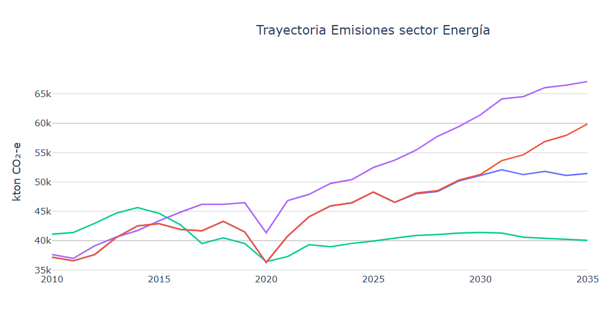
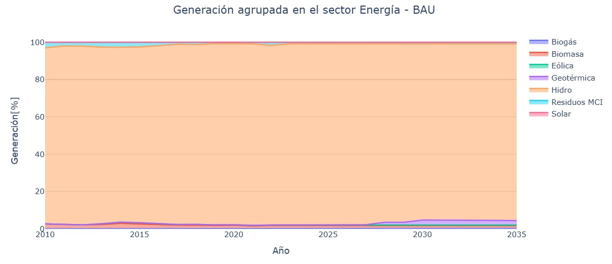
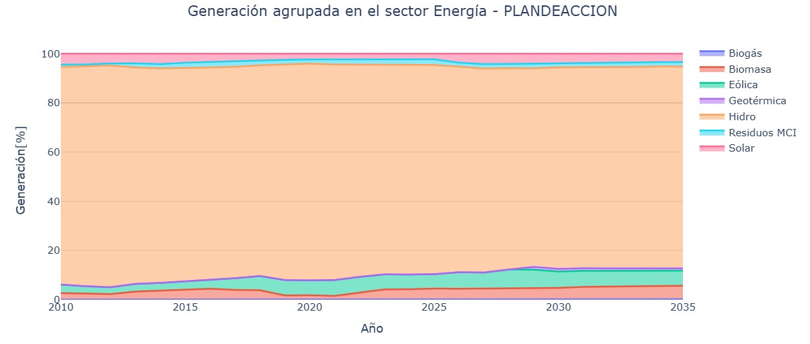

===================================
Resultados
===================================

La :numref:`energy_emissions` presenta las trayectorias de emisiones de GEI del sector
Energía para el Escenario Tendencial Nacional (línea morada) y Escenario
Plan de Acción del PLANMICC, Fase I (línea verde). La :numref:`energy_emissions` muestra
una divergencia progresiva entre el Escenario Tendencial Nacional y el
Escenario Plan de Acción del PLANMICC, Fase I, pues este último
incorpora medidas de mitigación. El Escenario Tendencial Nacional
presenta un aumento de las emisiones de GEI que parte en 37.000 kton
CO₂-eq en 2010 y se proyecta hacia las 69.000 kton CO₂-eq en 2035. Por
su parte, el Escenario Plan de Acción del PLANMICC, Fase I alcanza
49.000 kton CO₂-eq en 2035, manteniéndose consistentemente por debajo
del Escenario Tendencial Nacional durante todo el horizonte
2025-2035, lo que refleja el efecto acumulado de las medidas de
mitigación implementadas en el sector Energía. Los escenarios NDCINC y
NDCCON correspondientes a las contribuciones incondicional y condicional
de la Segunda NDC y se incluyen únicamente como referencias comparativas
dentro de la :numref:`energy_emissions`.

   Trayectoria de emisiones de gases de efecto invernadero del sector Energía bajo distintos escenarios (2010–2035)

La :numref:`energy_participation_bau` muestra
el porcentaje de generación eléctrica agrupada para el sector Energía en
el Escenario Tendencial Nacional. La :numref:`energy_participation_bau` permite notar la
participación relativa de cada fuente de energía en el período
2010–2035. Se observa que la generación hidroeléctrica prevalece en la
matriz energética durante todo el periodo de análisis 2010-2035,
manteniéndose cercana al 97% del total. En contraste, las demás fuentes
de energía: solar, eólica, biomasa, biogás, geotérmica y residuos MCI
contribuyen siempre por debajo del 6 %, incluso hacia el final del
período de análisis (2035).

   Participación porcentual de las diversas fuentes de energía renovable en la generación de eléctricidad – Escenario Tendencial Nacional (2010–2035)

En la :numref:`energy_participation_pa` se muestra la generación eléctrica agrupada del sector Energía en el
muestra el porcentaje de generación de electricidad agrupada del sector
Energía en el Escenario Plan de Acción del PLANMICC, Fase I, en el
período 2010–2035. Se observa que la hidroelectricidad continúa siendo
la principal fuente de generación durante todo el periodo de
análisis (2010-2035), aunque su participación disminuye un 3% respecto
al Escenario Tendencial Nacional. La contribución de
hidroelectricidad en el gráfico disminuye desde valores cercanos al 93 %
en los primeros años hacia alrededor del 81 % para el año 2035.
Paralelamente en el año 2035, otras fuentes renovables incrementan
gradualmente su contribución, a saber: solar, eólica, biomasa y
geotérmica. Estas cuatro fuentes de energía aumentan su participación
hasta situar su contribución en el 19 % para el final del
período de análisis (2035).

   Participación porcentual de las diversas fuentes de energía renovable en la generación de electricidad. – Escenario Plan de Acción del PLANMICC, Fase I (2010–2035).
