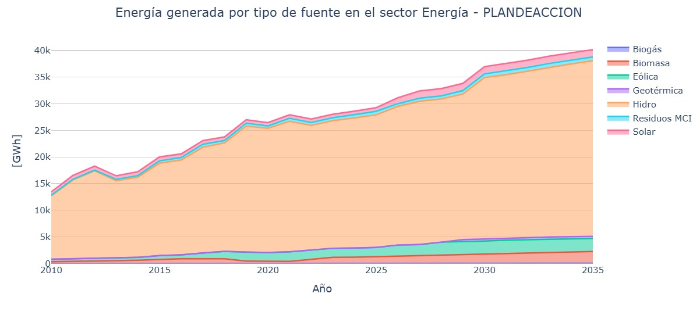
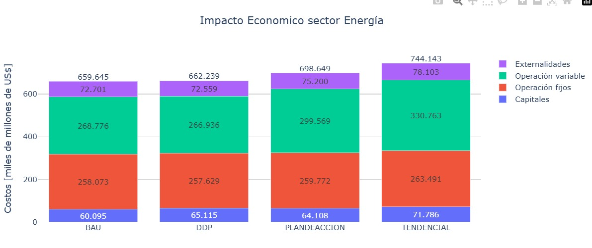
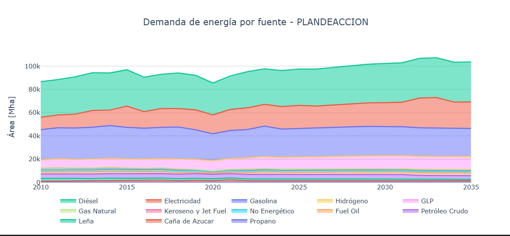

===================================
Resultados
===================================

Las trayectorias de emisiones de gases de efecto invernadero del sector
Energía se presentan en la :numref:`energy_emissions` para los distintos escenarios
analizados. Se observa una divergencia progresiva entre el escenario
tendencial y los escenarios que incorporan acciones de mitigación,
particularmente a partir de la segunda mitad del período de análisis. El
escenario de Plan de Acción presenta una trayectoria de emisiones
inferior al escenario tendencial, reflejando el efecto de la
incorporación de medidas de mitigación en el sector energético a lo
largo del horizonte 2010–2035.

.. figure:: ../_static/images/energy/emissions.png
   :name: energy_emissions
   :align: center
   :alt: Trayectoria de emisiones de gases de efecto invernadero del sector Energía bajo distintos escenarios (2010–2035)

   Trayectoria de emisiones de gases de efecto invernadero del sector Energía bajo distintos escenarios (2010–2035)

La :numref:`energy_participation_bau` presenta el porcentaje de generación eléctrica agrupada por
tipo de energías renovables en el Escenario Tendencial. En este
escenario se mantiene una estructura de generación relativamente estable
a lo largo del período de análisis, con una alta dependencia de la
generación hidroeléctrica y una limitada incorporación de nuevas
fuentes. La comparación con el Escenario Plan de Acción permite
evidenciar las diferencias en la evolución de la matriz eléctrica cuando
no se incorporan medidas adicionales de mitigación.

.. figure:: ../_static/images/energy/porcentual_participation_bau.png
   :name: energy_participation_bau
   :align: center
   :alt: Participación porcentual de la generación eléctrica en energía renovables– Escenario Tendencial (BAU) (2010–2035)

   Participación porcentual de la generación eléctrica en energía renovables– Escenario Tendencial (BAU) (2010–2035)

En la :numref:`energy_participation_pa` se muestra la participación porcentual de las fuentes de
generación eléctrica agrupadas por tipo de energía renovable bajo el
Escenario Plan de Acción. La generación hidroeléctrica continúa
representando la mayor proporción de la matriz eléctrica, mientras que
las fuentes renovables no convencionales incrementan gradualmente su
participación relativa. Este comportamiento evidencia una
diversificación progresiva de la matriz de generación asociada a la
implementación de acciones de mitigación.

.. figure:: ../_static/images/energy/porcentual_participation_plandeaccion.png
   :name: energy_participation_pa
   :align: center
   :alt: Participación porcentual de la generación eléctrica en energía renovables – Escenario Plan de Acción (2010–2035).

   Participación porcentual de la generación eléctrica en energía renovables – Escenario Plan de Acción (2010–2035).

En la :numref:`energy_generation_pa` se muestra la evolución de la energía generada (GWh) en
energías renovables en el sector Energía bajo el Escenario Plan de
Acción. La generación hidroeléctrica mantiene una participación
predominante durante todo el período de análisis, mientras que las
fuentes renovables no convencionales incrementan gradualmente su
contribución. Este comportamiento refleja la incorporación progresiva de
nuevas tecnologías de generación y la diversificación de la matriz
energética en el marco de las acciones de mitigación consideradas.

   Figura 6. Energía generada en energías renovables en el sector Energía – Escenario Plan de Acción (2010–2035).

El impacto económico asociado a los escenarios del sector Energía se
presenta en la :numref:`energy_economic_impact`, desagregado en costos de capital, costos de
operación fija, costos de operación variable y externalidades. Se
observan diferencias entre escenarios en la composición y magnitud de
los costos totales, siendo el escenario tendencial el que presenta el
mayor nivel de costos agregados. Los escenarios que incorporan acciones
de mitigación muestran variaciones en la estructura de costos, asociadas
a cambios en la matriz de generación y en la adopción tecnológica.

   Impacto económico del sector Energía por escenario, desagregado por componentes de costo.

La :numref:`energy_demand` presenta la evolución de la demanda de energía por tipo de
fuente bajo el Escenario Plan de Acción. A lo largo del período de
análisis se observa una demanda creciente, con variaciones en la
participación relativa de los distintos energéticos. Estos cambios
reflejan la transición progresiva en los patrones de consumo energético
y la incorporación de fuentes alternativas en el marco de las medidas de
eficiencia energética y movilidad sostenible consideradas.

   Demanda de energía por tipo de fuente en el sector Energía – Escenario Plan de Acción (2010–2035).
