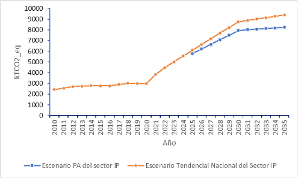

===================================================
Resultados
===================================================

Las :numref:`ippu_emissions` presenta una comparación entre las trayectorias de emisiones
de GEI del Escenario Tendencial Nacional y el Escenario Plan de Acción
del PLANMICC, el color naranja corresponde a el Escenario Tendencial
Nacional modelado desde el 2010, mientras que la línea de color azul
corresponde a el escenario Plan de Acción que incorpora las iniciativas
de mitigación aplicables al sector Procesos Industriales, incluyendo la
sustitución de clínker por adiciones en la producción de cemento y la
reducción progresiva del consumo de hidrofluorocarbonos (HFC) conforme a
la Enmienda de Kigali al Protocolo de Montreal.

   Evolución de las emisiones de gases de efecto invernadero del sector Procesos Industriales.

Los resultados muestran que, aunque las emisiones mantienen una
tendencia creciente en ambos escenarios, la implementación de estas
medidas permite reducir la trayectoria de crecimiento de las emisiones
respecto al escenario tendencial, evidenciando el efecto de las acciones
de mitigación previstas para el período 2025–2035.