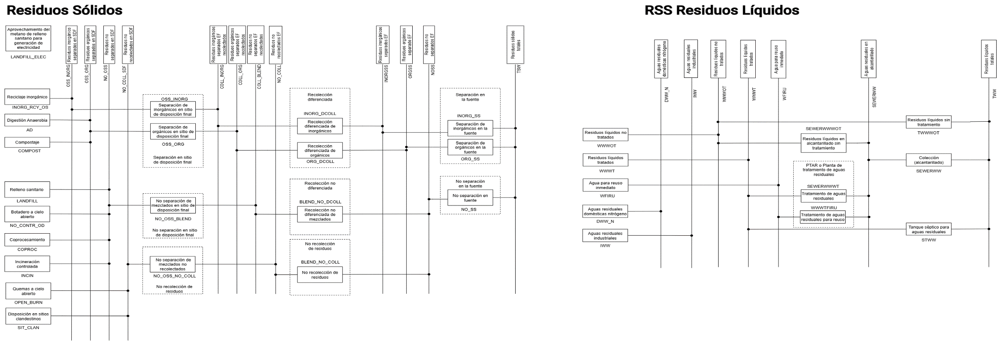

===================================
Estructura del modelo
===================================

Este sector produce emisiones por varias prácticas de disposición y
tratamiento de residuos sólidos y aguas residuales generadas en el país.
Para la construcción de los escenarios del sector Residuos se recopiló y
analizó información sobre generación producción per cápita de residuos,
generación de aguas residuales, porcentajes de reciclaje, Además, se
consideraron datos de emisiones de GEI sectoriales reportados en el
Inventario Nacional de Gases de Efecto Invernadero.

Es pertinente notar que el presente modelo no corresponde únicamente al
modelo OSeMOSYS que da soporte al Plan de Mitigación de cambio climático
(PLANMICC), sino que integra información actualizada del modelo OSeMOSYS
utilizado para estructurar la segunda NDC.

En particular:

- Del modelo OSeMOSYS que da soporte al PLANMICC se toman las
  estructuras base de tecnologías, factores de emisión y datos
  históricos.

- Del modelo OSeMOSYS utilizado para estructurar la segunda NDC se toman
  datos de actividad, factores de emisión actualizados con información
  de la Quinta Comunicación Nacional y Segundo Informe Bienal de
  Transparencia (5CN2BTR)

**Representación Gráfica del Modelo**

El modelo del sector Residuos fue estructurado a partir de la base
desarrollada en OSeMOSYS, utilizada como soporte analítico del Plan
Nacional de Mitigación del Cambio Climático (PLANMICC) (Proyecto CZZ
2739). Sobre esta base se integró la información de la Segunda
Contribución Determinada a Nivel Nacional (NDC), complementada con
insumos provenientes del PLANMICC. La estructura del modelo incorpora la
representación de actividades sectoriales, parámetros tecnológicos y
factores de emisión, lo que permite estimar la evolución de las
emisiones de GEI del sector bajo distintos supuestos de actividad y
medidas de mitigación.

De forma esquemática, el Sistema de Referencia de Fuentes (Reference
Source System, RSS) del sector de residuos sólidos se presenta en la
:numref:`waste_model_structure_solids`. y en la waste_model_structure_waters` se representa para el sector de aguas
residuales.

   Estructura base del Modelo del modelo del sector Residuos Sólidos.

   Estructura base del Modelo del modelo del sector Residuos líquidos.

En la :numref:`table_waste_techs`, :numref:`table_waste_commodities` y :numref:`table_waste_included_emissions` se incluye la nomenclatura de los sets
Technologies, Commodities y Emission del modelo de la :numref:`waste_model_structure_solids` y la :numref:`waste_model_structure_waters`.

.. _table_waste_techs:
.. table:: Tecnologías incluidas en el modelo del sector Residuos.

   +---------------+------------------------------------------------------+
   | Código        | Detalle                                              |
   +===============+======================================================+
   | COPROC        | Coprocesamiento                                      |
   +---------------+------------------------------------------------------+
   | INCIN         | Incineración controlada                              |
   +---------------+------------------------------------------------------+
   | OPEN_BURN     | Quema a cielo abierto                                |
   +---------------+------------------------------------------------------+
   | SIT_CLAN      | Disposición en sitios clandestinos                   |
   +---------------+------------------------------------------------------+
   | LANDFILL_ELEC | Aprovechamiento del metano de relleno sanitario para |
   |               | generación de electricidad                           |
   +---------------+------------------------------------------------------+
   | INORG_RCY_OS  | Reciclaje inorgánico                                 |
   +---------------+------------------------------------------------------+
   | AD            | Digestión anaerobia                                  |
   +---------------+------------------------------------------------------+
   | COMPOST       | Compostaje                                           |
   +---------------+------------------------------------------------------+
   | LANDFILL      | Relleno sanitario                                    |
   +---------------+------------------------------------------------------+
   | NO_CONTR_OD   | Botadero a cielo abierto                             |
   +---------------+------------------------------------------------------+
   | OSS_INORG     | Separación de inorgánicos en sitio de disposición    |
   |               | final                                                |
   +---------------+------------------------------------------------------+
   | OSS_ORG       | Separación de orgánicos en sitio de disposición      |
   |               | final                                                |
   +---------------+------------------------------------------------------+
   | NO_OSS_BLEND  | No separación de mezclados en sitio de disposición   |
   |               | final                                                |
   +---------------+------------------------------------------------------+
   | INORG_DCOLL   | Recolección diferenciada de inorgánicos              |
   +---------------+------------------------------------------------------+
   | ORG_DCOLL     | Recolección diferenciada de orgánicos                |
   +---------------+------------------------------------------------------+
   | B             | Recolección no diferenciada de mezclados             |
   | LEND_NO_DCOLL |                                                      |
   +---------------+------------------------------------------------------+
   | INORG_SS      | Separación de inorgánicos en la fuente               |
   +---------------+------------------------------------------------------+
   | ORG_SS        | Separación de orgánicos en la fuente                 |
   +---------------+------------------------------------------------------+
   | NO_SS         | No separación en la fuente                           |
   +---------------+------------------------------------------------------+
   | WWWOT         | Residuos líquidos no tratados                        |
   +---------------+------------------------------------------------------+
   | WWWT          | Residuos líquidos tratados                           |
   +---------------+------------------------------------------------------+
   | WFIRU         | Agua para reúso inmediato                            |
   +---------------+------------------------------------------------------+
   | SEWERWWWOT    | Residuos líquidos en alcantarillado sin tratamiento  |
   +---------------+------------------------------------------------------+
   | SEWERWWWT     | Tratamiento de aguas residuales                      |
   +---------------+------------------------------------------------------+
   | WWWTFIRU      | Tratamiento de aguas residuales para reúso           |
   +---------------+------------------------------------------------------+
   | TWWWOT        | Residuos líquidos sin tratamiento                    |
   +---------------+------------------------------------------------------+
   | SEWERWW       | Recolección (alcantarillado)                         |
   +---------------+------------------------------------------------------+
   | STWW          | Tanque séptico para aguas residuales                 |
   +---------------+------------------------------------------------------+
   | IWW           | Aguas residuales industriales                        |
   +---------------+------------------------------------------------------+

.. _table_waste_commodities:
.. table:: Commodities incluidos en el modelo del sector Residuos.

   +-------------+--------------------------------------------------------+
   | Código      | Detalle                                                |
   +=============+========================================================+
   | OSS_INORG   | Residuos inorgánicos separados en sitio de disposición |
   |             | final                                                  |
   +-------------+--------------------------------------------------------+
   | OSS_ORG     | Residuos orgánicos separados en sitio de disposición   |
   |             | final                                                  |
   +-------------+--------------------------------------------------------+
   | NO_OSS      | Residuos no separados en sitio de disposición final    |
   +-------------+--------------------------------------------------------+
   | COLL_INORG  | Residuos inorgánicos recolectados                      |
   +-------------+--------------------------------------------------------+
   | COLL_ORG    | Residuos orgánicos recolectados                        |
   +-------------+--------------------------------------------------------+
   | COLL_BLEND  | Residuos no separados recolectados                     |
   +-------------+--------------------------------------------------------+
   | INORGSS     | Residuos inorgánicos separados en la fuente            |
   +-------------+--------------------------------------------------------+
   | ORGSS       | Residuos orgánicos separados en la fuente              |
   +-------------+--------------------------------------------------------+
   | NOSS        | Residuo no separado en la fuente                       |
   +-------------+--------------------------------------------------------+
   | TSW         | Residuos sólidos                                       |
   +-------------+--------------------------------------------------------+
   | WWWOT       | Residuos líquidos no tratados                          |
   +-------------+--------------------------------------------------------+
   | WWWT        | Residuos líquidos tratados                             |
   +-------------+--------------------------------------------------------+
   | WFIRU       | Agua para reúso inmediato                              |
   +-------------+--------------------------------------------------------+
   | SEWERWW     | Aguas residuales en alcantarillado                     |
   +-------------+--------------------------------------------------------+
   | TWW         | Residuos líquidos totales                              |
   +-------------+--------------------------------------------------------+

.. _table_waste_included_emissions:
.. table:: Emisiones incluidas en el modelo del sector Residuos.

   +---------------+------------------------------------------------------+
   | CÓDIGO        | DEtalle                                              |
   +===============+======================================================+
   | LANDFILL      | Disposición en rellenos sanitarios                   |
   +---------------+------------------------------------------------------+
   | NO_CONTR_OD   | Botaderos a cielo abierto sin control                |
   +---------------+------------------------------------------------------+
   | COMPOST       | Procesos de compostaje y valorización biológica de   |
   |               | orgánicos                                            |
   +---------------+------------------------------------------------------+
   | INCIN         | Incineración de residuos                             |
   +---------------+------------------------------------------------------+
   | TWWWOT        | Aguas residuales domésticas sin colecta (*on-site*)  |
   +---------------+------------------------------------------------------+
   | SEWERWW       | Aguas residuales recolectadas en sistemas de         |
   |               | alcantarillado                                       |
   +---------------+------------------------------------------------------+
   | STWW          | Tratamiento en tanques sépticos                      |
   +---------------+------------------------------------------------------+
   | IWW           | Tratamiento de aguas residuales industriales         |
   +---------------+------------------------------------------------------+