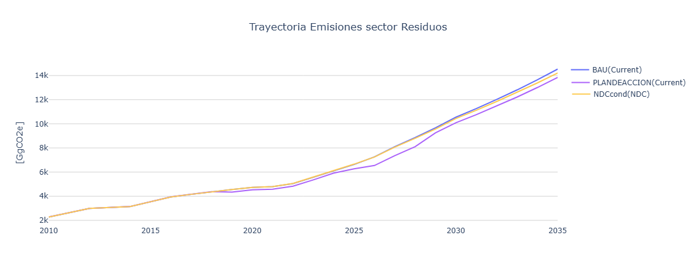

===================================================
Resultados
===================================================

La :numref:`waste_emissions` presenta las emisiones en CO2e para el sector Residuos por
año y escenario. En la figura la trayectoria azul representa el
escenario Tendencial; el escenario NDC Condicional de la 2da NDC de
color naranja se coloca como referencia y la trayectoria morada es el
escenario Plan de Acción.

   Emisiones en CO2 equivalente del sector residuos por año y escenario.
