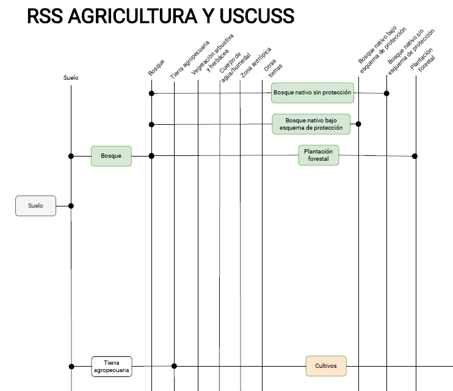

===================================
Estructura del modelo
===================================

Los sectores Agricultura y USCUSS fueron modelados de manera conjunta,
utilizando una única estructura para estos 2 sectores, similar a la
planteada en el PLANMICC. Este modelo no corresponde únicamente al
PLANMICC, sino que integra información actualizada de la NDC.

En particular:

- Del PLANMICC se toman las estructuras base de tecnologías y factores
  de emisión y datos históricos

- Del NDC se toman datos de actividad, factores de emisión actualizados
  con información de la 5CN2BTR

**Representación Gráfica del Modelo**

El modelo de los sectores Agricultura y USCUSS fue estructurado a partir
de la base desarrollada en el PLANMICC (Proyecto CZZ 2739), no se
aumentaron tecnologías ni se adicionaron variables únicamente se
actualizó información.

En la :numref:`agro_uscuss_model_structure` se presenta la estructura final del modelo de Agricultura
y USCUSS que constituye el insumo de referencia para el sector.

   Estructura base del Modelo de Agricultura y USCUSS

En la :numref:`table_agro_uscuss_techs` se detallan los nombres de las tecnologías/fuels y las
unidades de la actividad de cada tecnología/fuel acorde a Proyecto PLANMICC:

.. _table_agro_uscuss_techs:
.. table:: Tecnologías incluidas en el modelo del sector Residuos.

   +----------------------------+-----------------------------------------+
   | **Código**                 | **Detalle**                             |
   +============================+=========================================+
   | Banano                     | Área de cultivo cosechado Mha           |
   +----------------------------+-----------------------------------------+
   | Arroz                      | Área de cultivo cosechado Mha           |
   +----------------------------+-----------------------------------------+
   | Cacao                      | Área de cultivo cosechado Mha           |
   +----------------------------+-----------------------------------------+
   | Cafe                       | Área de cultivo cosechado Mha           |
   +----------------------------+-----------------------------------------+
   | Cana                       | Área de cultivo cosechado Mha           |
   +----------------------------+-----------------------------------------+
   | Maiz                       | Área de cultivo cosechado Mha           |
   +----------------------------+-----------------------------------------+
   | Palma                      | Área de cultivo cosechado Mha           |
   +----------------------------+-----------------------------------------+
   | Soya                       | Área de cultivo cosechado Mha           |
   +----------------------------+-----------------------------------------+
   | Palmito                    | Área de cultivo cosechado Mha           |
   +----------------------------+-----------------------------------------+
   | Legumbres                  | Área de cultivo cosechado Mha           |
   +----------------------------+-----------------------------------------+
   | Cereales                   | Área de cultivo cosechado Mha           |
   +----------------------------+-----------------------------------------+
   | Tuberculos                 | Área de cultivo cosechado Mha           |
   +----------------------------+-----------------------------------------+
   | Fruta                      | Área de cultivo cosechado Mha           |
   +----------------------------+-----------------------------------------+
   | Verduras                   | Área de cultivo cosechado Mha           |
   +----------------------------+-----------------------------------------+
   | Floricolas                 | Área de cultivo cosechado Mha           |
   +----------------------------+-----------------------------------------+
   | Otros_cultivos             | Área de cultivo cosechado Mha           |
   +----------------------------+-----------------------------------------+
   | Exp_Banano                 | Volumen de producto exportado Mton      |
   +----------------------------+-----------------------------------------+
   | Exp_Arroz                  | Volumen de producto exportado Mton      |
   +----------------------------+-----------------------------------------+
   | Exp_Cacao                  | Volumen de producto exportado Mton      |
   +----------------------------+-----------------------------------------+
   | Exp_Cafe                   | Volumen de producto exportado Mton      |
   +----------------------------+-----------------------------------------+
   | Exp_Cana                   | Volumen de producto exportado Mton      |
   +----------------------------+-----------------------------------------+
   | Exp_Maiz                   | Volumen de producto exportado Mton      |
   +----------------------------+-----------------------------------------+
   | Exp_Palma                  | Volumen de producto exportado Mton      |
   +----------------------------+-----------------------------------------+
   | Exp_Soya                   | Volumen de producto exportado Mton      |
   +----------------------------+-----------------------------------------+
   | Exp_Palmito                | Volumen de producto exportado Mton      |
   +----------------------------+-----------------------------------------+
   | Exp_Legumbres              | Volumen de producto exportado Mton      |
   +----------------------------+-----------------------------------------+
   | Exp_Cereales               | Volumen de producto exportado Mton      |
   +----------------------------+-----------------------------------------+
   | Exp_Tuberculos             | Volumen de producto exportado Mton      |
   +----------------------------+-----------------------------------------+
   | Exp_Fruta                  | Volumen de producto exportado Mton      |
   +----------------------------+-----------------------------------------+
   | Exp_Verduras               | Volumen de producto exportado Mton      |
   +----------------------------+-----------------------------------------+
   | Exp_Floricolas             | Volumen de producto exportado Mton      |
   +----------------------------+-----------------------------------------+
   | Imp_Banano                 | Volumen de producto importado Mton      |
   +----------------------------+-----------------------------------------+
   | Imp_Arroz                  | Volumen de producto importado Mton      |
   +----------------------------+-----------------------------------------+
   | Imp_Cacao                  | Volumen de producto importado Mton      |
   +----------------------------+-----------------------------------------+
   | Imp_Cafe                   | Volumen de producto importado Mton      |
   +----------------------------+-----------------------------------------+
   | Imp_Cana                   | Volumen de producto importado Mton      |
   +----------------------------+-----------------------------------------+
   | Imp_Maiz                   | Volumen de producto importado Mton      |
   +----------------------------+-----------------------------------------+
   | Imp_Palma                  | Volumen de producto importado Mton      |
   +----------------------------+-----------------------------------------+
   | Imp_Soya                   | Volumen de producto importado Mton      |
   +----------------------------+-----------------------------------------+
   | Imp_Palmito                | Volumen de producto importado Mton      |
   +----------------------------+-----------------------------------------+
   | Imp_Legumbres              | Volumen de producto importado Mton      |
   +----------------------------+-----------------------------------------+
   | Imp_Cereales               | Volumen de producto importado Mton      |
   +----------------------------+-----------------------------------------+
   | Imp_Tuberculos             | Volumen de producto importado Mton      |
   +----------------------------+-----------------------------------------+
   | Imp_Fruta                  | Volumen de producto importado Mton      |
   +----------------------------+-----------------------------------------+
   | Imp_Verduras               | Volumen de producto importado Mton      |
   +----------------------------+-----------------------------------------+
   | Imp_Floricolas             | Volumen de producto importado Mton      |
   +----------------------------+-----------------------------------------+
   | Pastizales                 | Área de categoría de suelo Mha          |
   +----------------------------+-----------------------------------------+
   | Humedal                    | Área de categoría de suelo Mha          |
   +----------------------------+-----------------------------------------+
   | Zona_atropica              | Área de categoría de suelo Mha          |
   +----------------------------+-----------------------------------------+
   | Otras_tierras              | Área de categoría de suelo Mha          |
   +----------------------------+-----------------------------------------+
   | Bosque_nativo_protegido    | Área de bosque con algún régimen de     |
   |                            | protección legal: Socio Bosque, SNAP,   |
   |                            | BVP Mha                                 |
   +----------------------------+-----------------------------------------+
   | Bosque_nativo_sinproteger  | Área de bosque sin régimen de           |
   |                            | protección legal Mha                    |
   +----------------------------+-----------------------------------------+
   | Plantacion_forestal        | Área de Plantaciones Forestales Mha     |
   +----------------------------+-----------------------------------------+
   | Ganaderia_importada        | Área de ganado bobino Mha               |
   +----------------------------+-----------------------------------------+
   | Ganaderia_criolla          | Área de ganado bobino Mha               |
   +----------------------------+-----------------------------------------+
   | Ganaderia_mestiza          | Área de ganado bobino Mha               |
   +----------------------------+-----------------------------------------+
   | Exp_Carne                  | Volumen de producto exportado Mton      |
   +----------------------------+-----------------------------------------+
   | Exp_Leche                  | Volumen de producto exportado Mton      |
   +----------------------------+-----------------------------------------+
   | Imp_Carne                  | Volumen de producto importado Mton      |
   +----------------------------+-----------------------------------------+
   | Imp_Leche                  | Volumen de producto importado Mton      |
   +----------------------------+-----------------------------------------+
   | Gallinas_campos            | Cantidad de aves de corral k cabezas    |
   +----------------------------+-----------------------------------------+
   | Gallinas_planteles         | Cantidad de aves de corral k cabezas    |
   +----------------------------+-----------------------------------------+
   | Pasturas                   | Área de categoría de suelo Mha          |
   +----------------------------+-----------------------------------------+
   | Vacuno_porcino             | Cantidad de cabeza de ganado k cabezas  |
   +----------------------------+-----------------------------------------+
   | Vacuno_ovino               | Cantidad de cabeza de ganado k cabezas  |
   +----------------------------+-----------------------------------------+
   | Vacuno_otras_especies      | Cantidad de cabeza de ganado k cabezas  |
   +----------------------------+-----------------------------------------+
   | Cambio_de_uso              | /                                       |
   +----------------------------+-----------------------------------------+
   | area_restaurada            | /                                       |
   +----------------------------+-----------------------------------------+
