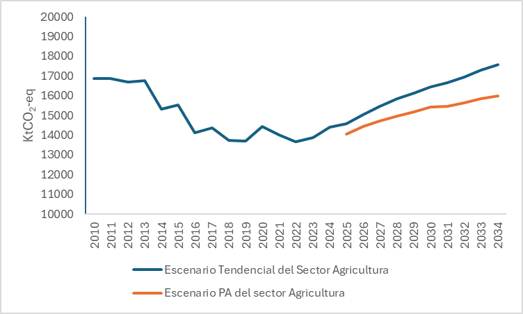
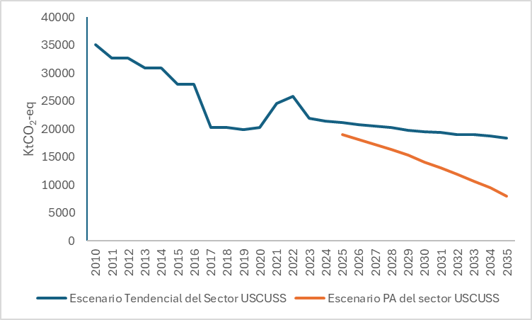

===================================================
Resultados
===================================================

La :numref:`agro_emissions` y :numref:`uscuss_emissions`, presentan las emisiones de CO2 eq tanto de los
sectores Agricultura y USCUSS respectivamente. En las figuras el color
azul representa el escenario tendencial modelados desde el 2010,
mientras que la línea de color rojo representa el escenario Plan de
Acción donde se incorporan los esfuerzos de mitigación.

   Evolución de emisiones del sector Agricultura

En el sector Agricultura las emisiones de GEI responden al incremento
esperado en la producción necesario para garantizar la soberanía
alimentaria frente al crecimiento demográfico en el país. Sin embargo,
el PA contempla mayor eficiencia productiva, más rendimiento por
hectárea, mediante manejo eficiente de nutrientes y adopción de
tecnologías agrícolas. Estas tecnologías incluyen sistemas de riego
tecnificado (goteo y aspersión), fertirrigación, agricultura de
precisión, manejo integrado de suelos, sensores y seguimiento climático,
labranza reducida y mecanismos de postcosecha que minimizan pérdidas y
mejoran la eficiencia en el uso de insumos.

   Evolución de emisiones del sector USCUSS

La Ilustración, presenta una comparación entre las trayectorias y
magnitud de las emisiones de GEI en el Escenario Tendencial Nacional y
en el Escenario Plan de Acción evidenciando una disminución progresiva
de emisiones en el Escenario Plan de Acción debido a un aumento de la
cobertura boscosa nacional bajo algún régimen de protección legal. Este
comportamiento refuerza el rol del sector como sumidero neto de carbono
en el mediano plazo.

En el Escenario Plan de Acción, la tasa de ingreso de bosques no
protegidos hacia convenios de conservación o hacia sistemas de manejo
sostenible de bosque podrá hacerse efectiva con el ingreso de
iniciativas privadas o de gobiernos locales